<div align="center">

<!-- ═══════════════ PERSONA 5 PHANTOM THIEVES PORTFOLIO ═══════════════ -->

<!-- Quantum Physics Banner -->


<!-- Professional Name Display -->
<div align="center" style="margin-top: 30px; position: relative; z-index: 10;">
  <h1 style="font-family: 'Bebas Neue', sans-serif; font-size: 48px; color: #FF0000; margin: 0; text-shadow: 2px 2px 4px rgba(0,0,0,0.8), -1px -1px 0px white, 1px -1px 0px white, -1px 1px 0px white, 1px 1px 0px white;">SAMUEL GYTHIA</h1>
  <p style="font-family: 'Oswald', sans-serif; font-size: 18px; color: #FFFFFF; margin: 10px 0 0 0; text-shadow: 2px 2px 4px rgba(0,0,0,0.9);">PHANTOM THIEF OF CODE • QUANTUM RESEARCHER</p>
</div>

<!-- Persona 5 Style Profile Picture with Mask Effect -->


<!-- Persona 5 Status Badges -->
<p align="center" style="margin-top: 30px;">
  
  
  
</p>

</div>

<div align="center" style="background: linear-gradient(45deg, #000000, #FF0000, #000000); padding: 25px; border-radius: 20px; border: 2px solid #FF0000;">

### 🎭 *"I am thou, thou art I... Let's steal some hearts with code!"* 🎭

---

## 🔥 **PHANTOM THIEVES CODEX**

*◆ Welcome to the Metaverse of Programming ◆*

</div>

<!-- Persona 5 Style Project Showcase with Red/Black Aesthetics -->
<table align="center" width="100%" style="background: linear-gradient(135deg, #000000, #330000, #000000); border-radius: 25px; padding: 25px; border: 3px solid #FF0000;">
<tr>
<td align="center" width="33%" style="padding: 20px;">

### 🎯 **PHANTOM ALGORITHMS**

<a href="https://github.com/samuel-gythia/bose-hubbard-mott-transition">
  
</a>

<a href="https://github.com/samuel-gythia/lattice-qed-schwinger-model">
  
</a>

<a href="https://github.com/samuel-gythia/optomechanical-cavity-cooling">
  
</a>

*◆ Quantum many-body systems and phase transitions ◆*

</td>
<td align="center" width="33%" style="padding: 20px;">

### 🌟 **METAVERSE OPTICS**

<a href="https://github.com/samuel-gythia/continuous-variable-squeezing">
  
</a>

<a href="https://github.com/samuel-gythia/fdtd-photonic-waveguide-coupling">
  
</a>

<a href="https://github.com/samuel-gythia/microring-photonic-modulator">
  
</a>

*◆ Photonic systems and optical quantum computing ◆*

</td>
<td align="center" width="33%" style="padding: 20px;">

### 🎭 **COGNITIVE COMPUTING**

<a href="https://github.com/samuel-gythia/quantum-clifford-verification">
  
</a>

<a href="https://github.com/samuel-gythia/quantum-ml-verification-confidence">
  
</a>

<a href="https://github.com/samuel-gythia/nv-diamond-magnetometry">
  
</a>

*◆ Machine learning and quantum algorithm verification ◆*

</td>
</tr>
</table>

---

<div align="center">

## 🎭 **CURRENT HEIST MISSION**

</div>

<table align="center" width="90%" style="background: linear-gradient(135deg, #000000, #FF0000, #000000); border-radius: 25px; padding: 25px; border: 3px solid #FF0000;">
<tr>
<td align="center" width="50%" style="padding: 25px;">

### 🎯 **PHANTOM THIEF JOURNEY**
```yaml
Status: "Master's → PhD Palace Infiltration"
Target: "Quantum Computing & Simulation Hearts"
Next_Palace: "Germany (2026-202X)"
Languages: "German (A1-A2) | English (Phantom)"
Specialization: "Metaverse Physics & Computation"
Calling_Card: "Prepare for cognitive revolution!"
```

</td>
<td align="center" width="50%" style="padding: 25px;">

### ⚗️ **PHANTOM ARSENAL**
```yaml
Current_Heist: "Quantum Algorithm Heart Stealing"
Phantom_Tools: "Python | QuTiP | Qiskit | Cirq"
Mission_Focus: "Computational Physics Rebellion"
Status: "All-Out Attack Phase"
Architecture: "Modular Phantom Libraries"
Persona: "Quantum Code Arsène"
```

</td>
</tr>
</table>

---

<div align="center">

## ⚔️ **PHANTOM THIEF ARSENAL**

</div>

<div align="center" style="background: linear-gradient(135deg, #000000, #FF0000, #000000); border-radius: 15px; padding: 30px; border: 2px solid #FF0000;">

### **⚛️ PHANTOM SCIENTIFIC ARSENAL**


### **🛠️ PHANTOM THIEF TOOLS**


</div>

---

<div align="center">

## 📊 **PHANTOM THIEF STATISTICS**

</div>

<div align="center" style="background: linear-gradient(135deg, #000000, #FF0000, #000000); border-radius: 20px; padding: 30px; border: 2px solid #FF0000;">

<!-- Persona 5 Themed GitHub Stats -->


</div>

<div align="center" style="margin-top: 20px;">

<!-- Persona 5 Themed Language Stats -->


</div>

---

<div align="center">

## 📈 **PHANTOM COMMIT ACTIVITY**

</div>

<div align="center" style="background: linear-gradient(135deg, #000000, #FF0000, #000000); border-radius: 20px; padding: 20px; border: 2px solid #FF0000;">

<!-- Persona 5 Themed Contribution Graph -->


</div>

<div align="center" style="margin-top: 30px; background: linear-gradient(135deg, #000000, #FF0000, #000000); border-radius: 15px; padding: 25px; border: 2px solid #FF0000;">

### 🎯 **RECENT PHANTOM ACCOMPLISHMENTS**

<table width="100%">
<tr>
<td align="center" width="50%" style="padding: 20px;">

#### 🔥 **MAJOR HEISTS COMPLETED**
- ✨ Enhanced Persona 5 Banner Design
- 🎭 Quantum Physics Portfolio Launch  
- 🔐 Phantom Thief Theme Implementation
- ⚡ Advanced SVG Animations Added

</td>
<td align="center" width="50%" style="padding: 20px;">

#### 🎯 **NEXT TARGETS**
- 🎪 PhD Application Preparation
- 🌟 Quantum Computing Research
- 🎨 Advanced Portfolio Features
- 🎭 Community Engagement Growth

</td>
</tr>
</table>

</div>

---

<div align="center">

## 🌙 **BEYOND THE PHANTOM REALM**

</div>

<div align="center" style="background: linear-gradient(135deg, #000000, #FF0000, #000000); border-radius: 20px; padding: 30px; border: 2px solid #FF0000;">

<table width="90%">
<tr>
<td align="center" width="50%" style="padding: 20px;">

### ✍️ **CREATIVE CHRONICLES**
*◆ Crafting a 21-volume dark fantasy saga ◆*  
*Exploring survival, trauma, and transformation*  
*Across diverse real-world nations*  
*Where shadows meet light*

</td>
<td align="center" width="50%" style="padding: 20px;">

### 🤝 **COLLABORATIVE VENTURES**
*◆ Quantum computing research & simulations ◆*  
*Open-source physics computational tools*  
*Quantum algorithm development*  
*Academic opportunities in EU/Germany*

</td>
</tr>
</table>

</div>

---

<div align="center">

## 🎴 **CALLING CARD**

</div>

<div align="center" style="background: linear-gradient(135deg, #000000, #FF0000, #000000); border-radius: 15px; padding: 30px; border: 2px solid #FF0000;">

<a href="mailto:samuel.gythia@outlook.com">
  
</a>
<a href="https://guns.lol/samuelgythia">
  
</a>
<a href="https://github.com/samuel-gythia">
  
</a>

</div>

---

<div align="center">

## 🎭 **PHANTOM THIEF MANIFESTO**

*"I am thou, thou art I...*  
*From the depths of the metaverse, we shall steal hearts through code.*  
*Take your time... perfect algorithms await those who dare to rebel."*

**- The Phantom Thieves of Code**

</div>

<!-- Stats updated: 2025-06-04 Auto-refresh enabled -->
