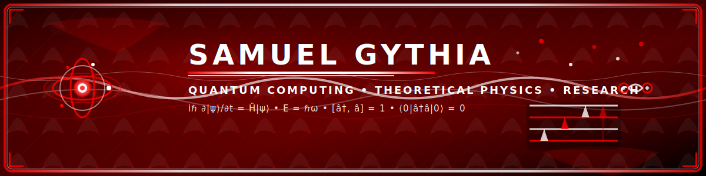

<div align="center">

<!-- ═══════════════ SAMUEL GYTHIA RESEARCH PORTFOLIO ═══════════════ -->

<!-- Quantum Physics Banner -->


<!-- Professional Name Display -->
<div align="center" style="margin-top: 30px; position: relative; z-index: 10;">
  <h1 style="font-family: 'Bebas Neue', sans-serif; font-size: 48px; color: #FF0000; margin: 0; text-shadow: 2px 2px 4px rgba(0,0,0,0.8), -1px -1px 0px white, 1px -1px 0px white, -1px 1px 0px white, 1px 1px 0px white;">SAMUEL GYTHIA</h1>
  <p style="font-family: 'Oswald', sans-serif; font-size: 18px; color: #FFFFFF; margin: 10px 0 0 0; text-shadow: 2px 2px 4px rgba(0,0,0,0.9);">QUANTUM PHYSICIST • COMPUTATIONAL RESEARCHER</p>
</div>

<!-- Persona 5 Style Profile Picture with Mask Effect -->


<!-- Professional Status Badges -->
<p align="center" style="margin-top: 30px;">
    
  
</p>

</div>

<div align="center" style="background: linear-gradient(45deg, #000000, #FF0000, #000000); padding: 25px; border-radius: 20px; border: 2px solid #FF0000;">

### 🔬 *"Exploring the quantum realm through computational innovation"* 🔬

---

## 🔥 **RESEARCH PORTFOLIO**

*◇ Advanced Quantum Computing & Simulation Research ◇*

</div>

<!-- Professional Project Showcase with Red/Black Aesthetics -->
<table align="center" width="100%" style="background: linear-gradient(135deg, #000000, #330000, #000000); border-radius: 25px; padding: 25px; border: 3px solid #FF0000;">
<tr>
<td align="center" width="33%" style="padding: 20px;">

### 🎯 **QUANTUM ALGORITHMS**

<a href="https://github.com/samuel-gythia/bose-hubbard-mott-transition">
  
</a>

<a href="https://github.com/samuel-gythia/lattice-qed-schwinger-model">
  
</a>

<a href="https://github.com/samuel-gythia/optomechanical-cavity-cooling">
  
</a>

*◇ Quantum many-body systems and phase transitions ◇*

</td>
<td align="center" width="33%" style="padding: 20px;">

### 🌟 **QUANTUM OPTICS**

<a href="https://github.com/samuel-gythia/continuous-variable-squeezing">
  
</a>

<a href="https://github.com/samuel-gythia/fdtd-photonic-waveguide-coupling">
  
</a>

<a href="https://github.com/samuel-gythia/microring-photonic-modulator">
  
</a>

*◇ Photonic systems and optical quantum computing ◇*

</td>
<td align="center" width="33%" style="padding: 20px;">

### 🎭 **MACHINE LEARNING**

<a href="https://github.com/samuel-gythia/quantum-clifford-verification">
  
</a>

<a href="https://github.com/samuel-gythia/quantum-ml-verification-confidence">
  
</a>

<a href="https://github.com/samuel-gythia/nv-diamond-magnetometry">
  
</a>

*◇ Machine learning and quantum algorithm verification ◇*

</td>
</tr>
</table>

---

<div align="center">

## 🎯 **CURRENT RESEARCH FOCUS**

</div>

<table align="center" width="90%" style="background: linear-gradient(135deg, #000000, #FF0000, #000000); border-radius: 25px; padding: 25px; border: 3px solid #FF0000;">
<tr>
<td align="center" width="50%" style="padding: 25px;">

### 🎯 **ACADEMIC TRAJECTORY**
```yaml
Status: "Master's → PhD Application Phase"
Focus: "Quantum Computing & Simulation Research"
Target: "Germany PhD Programs (2026-2030)"
Languages: "German (A1-A2 → B2) | English (Native)"
Specialization: "Quantum Physics & Computation"
Objective: "Advancing quantum algorithm development"
```

</td>
<td align="center" width="50%" style="padding: 25px;">

### ⚗️ **RESEARCH TOOLKIT**
```yaml
Current_Research: "Quantum Algorithm Development"
Primary_Tools: "Python | QuTiP | Qiskit | Cirq"
Focus_Area: "Computational Physics & Simulation"
Status: "Active Development Phase"
Architecture: "Modular Scientific Libraries"
Approach: "Open-Source Research Methods"
```

</td>
</tr>
</table>

---

<div align="center">

## ⚔️ **RESEARCH TOOLKIT**

</div>

<div align="center" style="background: linear-gradient(135deg, #000000, #FF0000, #000000); border-radius: 15px; padding: 30px; border: 2px solid #FF0000;">

### **⚛️ SCIENTIFIC COMPUTING STACK**


### **🛠️ DEVELOPMENT TOOLS**


</div>

---

<div align="center">

## 📊 **GITHUB STATISTICS**

</div>

<div align="center" style="background: linear-gradient(135deg, #000000, #FF0000, #000000); border-radius: 20px; padding: 30px; border: 2px solid #FF0000;">

<!-- Professional GitHub Stats with Red/Black Theme -->


</div>

<div align="center" style="margin-top: 20px;">

<!-- Professional Language Stats -->


</div>

---

<div align="center">

## 📈 **DEVELOPMENT ACTIVITY**

</div>

<div align="center" style="background: linear-gradient(135deg, #000000, #FF0000, #000000); border-radius: 20px; padding: 20px; border: 2px solid #FF0000;">

<!-- Professional Contribution Graph -->


</div>

<div align="center" style="margin-top: 30px; background: linear-gradient(135deg, #000000, #FF0000, #000000); border-radius: 15px; padding: 25px; border: 2px solid #FF0000;">

### 🎯 **RESEARCH PORTFOLIO & OBJECTIVES**

<table width="100%">
<tr>
<td align="center" width="50%" style="padding: 20px;">

#### 🎯 **RESEARCH ACHIEVEMENTS**
- 📄 **Quantum Error Correction** - Published research on QEC protocols
- ⚛️ **Many-Body Physics** - Bose-Hubbard Mott transition computational analysis
- 🔬 **Lattice Field Theory** - Schwinger model simulation and quantum algorithms
- 💎 **Quantum Sensing** - NV centers in diamond for precision magnetometry
- 🌟 **Quantum Optics** - Continuous variable squeezing and cavity cooling systems
- 🧮 **Computational Methods** - FDTD photonic waveguide coupling simulations

</td>
<td align="center" width="50%" style="padding: 20px;">

#### 🎯 **RESEARCH OBJECTIVES**
- 🎓 **PhD Applications** - Quantum computing programs in Germany (2026)
- 🔬 **Advanced Research** - Quantum simulation and algorithm development
- 📚 **Academic Preparation** - German language proficiency (A1-A2 → B2)
- 🌐 **Collaboration** - Open-source quantum physics computational tools
- 📖 **Publications** - Manuscript preparation for peer-reviewed journals

</td>
</tr>
</table>

</div>

---

<div align="center">

## 🌙 **BEYOND RESEARCH**

</div>

<div align="center" style="background: linear-gradient(135deg, #000000, #FF0000, #000000); border-radius: 20px; padding: 30px; border: 2px solid #FF0000;">

<table width="90%">
<tr>
<td align="center" width="50%" style="padding: 20px;">

### ✍️ **CREATIVE PURSUITS**
*◇ Crafting a 21-volume dark fantasy literary series ◇*  
*Exploring themes of survival, trauma, and transformation*  
*Across diverse real-world cultural settings*  
*Where shadows meet light*

</td>
<td align="center" width="50%" style="padding: 20px;">

### 🤝 **RESEARCH COLLABORATION**
*◇ Quantum computing research & simulations ◇*  
*Open-source physics computational tools*  
*Quantum algorithm development*  
*Academic opportunities in EU/Germany*

</td>
</tr>
</table>

</div>

---

<div align="center">

## 📧 **CONTACT INFORMATION**

</div>

<div align="center" style="background: linear-gradient(135deg, #000000, #FF0000, #000000); border-radius: 15px; padding: 30px; border: 2px solid #FF0000;">

<a href="mailto:samuel.gythia@outlook.com">
  
</a>
<a href="https://guns.lol/samuelgythia">  
</a>
<a href="https://github.com/samuel-gythia">
  
</a>

</div>

---

<div align="center">

## 🔬 **RESEARCH PHILOSOPHY**

*"Exploring the quantum realm through computational innovation...*  
*From theoretical foundations to practical implementations.*  
*Advancing our understanding of quantum systems through rigorous research."*

**- Samuel Gythia, Quantum Researcher**

</div>

<!-- Stats updated: 2025-06-04 Auto-refresh enabled -->
